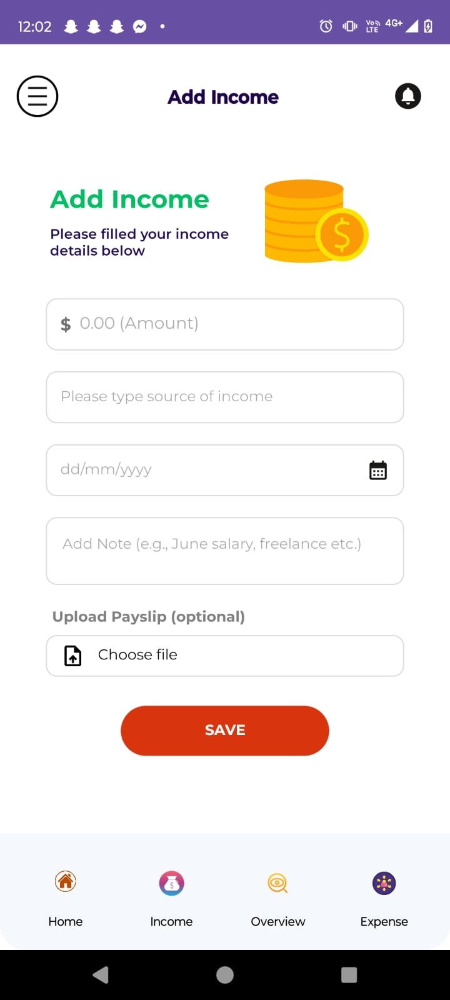
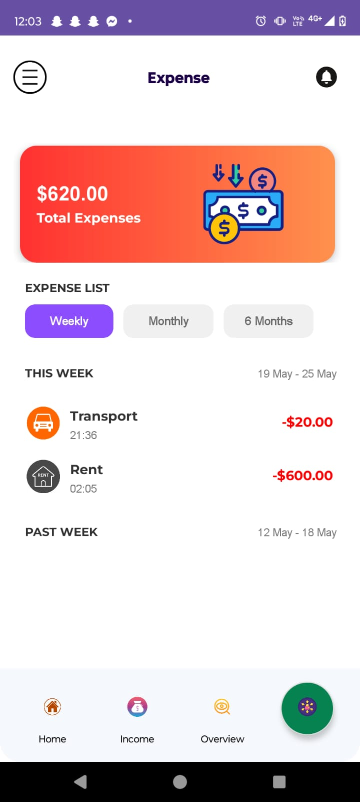
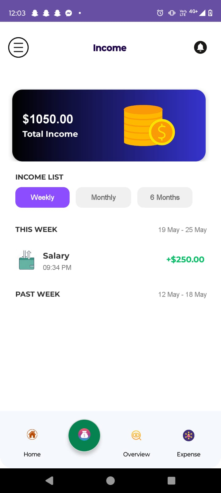
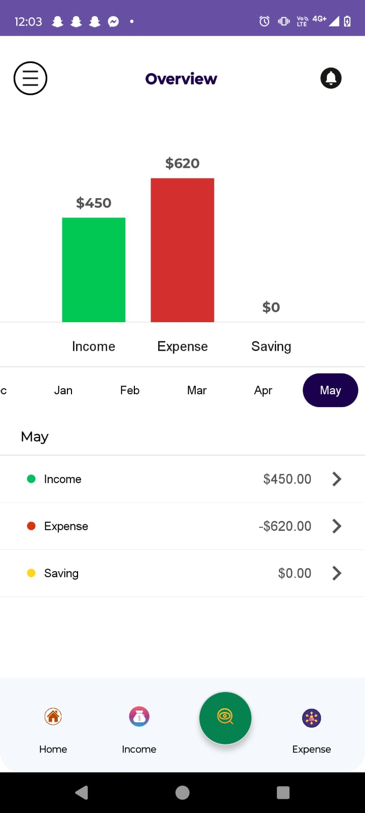
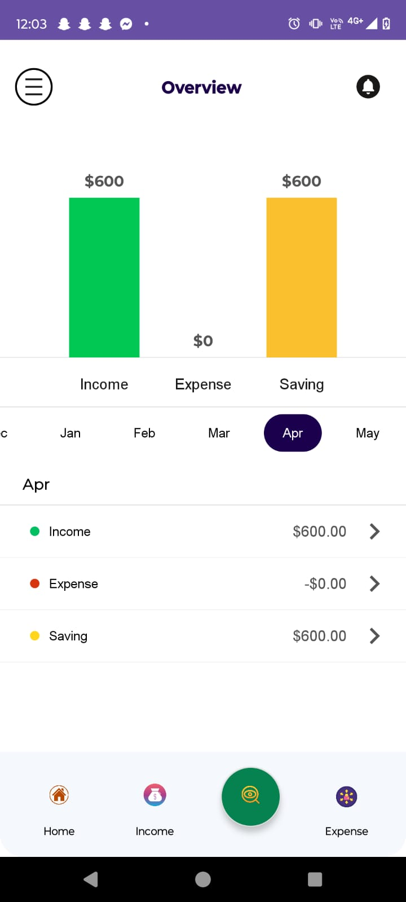
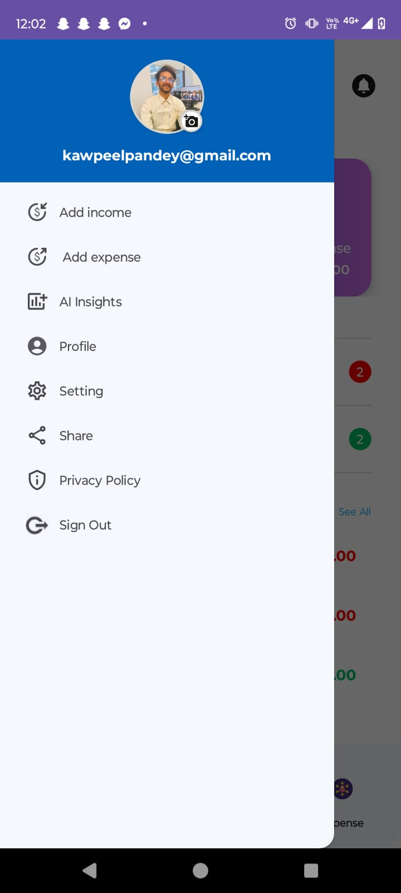

# 📊 GenAI Expense Tracker App

A smart and modern mobile app built using **Android (Java/XML)** and **Firebase** to help users track their income and expenses, analyze spending patterns, and receive AI-generated financial insights in real time.

---

## 🚀 Features

- 📥 Add & categorize expenses and income
- 📊 Overview screen with custom BarChart (income vs expense vs savings)
- 🔐 Firebase Authentication (Email/Google/Facebook)
- ☁️ Data synced using Cloud Firestore
- 📁 Optional receipt/image upload to Firebase Storage
- 🧠 AI-driven insights & alerts (via OpenAI + Firebase Extensions)
- 📆 Filter by week, month, or 6 months using ChipGroup
- 🎨 Modern UI/UX using custom design and icon sets
- 📲 Built for native Android devices

---

## 🛠 Tech Stack

- **Language:** Java
- **UI:** XML + Material 3 Components, Custom Views with Canvas
- **Architecture:** MVVM (ViewModel, LiveData)
- **Backend:** Firebase (Auth, Firestore, Storage)
- **Extras:** OpenAI API, Lottie Animations, Glide, 

---

## 📸 Screenshots

| Welcome Screen | Sign In | Sign In (Loading) | Sign In (Failed) |
|----------------|---------|-------------------|------------------|
|  |  |  |  |

| Sign In (Failed v2) | Sign Up | Forgot Password | Home (Dashboard) |
|---------------------|---------|------------------|------------------|
|  |  |  | _UI.jpg) |

| Add Expense | Expense | Income | Income (Monthly) |
|-------------|---------|--------|------------------|
|  |  |  |  |

| Overview | Overview (Income/Expense) | Nav Bar Menu |
|----------|----------------------------|---------------|
|  |  |  |

>  📁 To properly display screenshots above, create a folder named `/screenshots` and upload the image files into it.

---

## 📦 How to Run

1. Clone this repo:  
   `git clone https://github.com/KapilPandey94/genai-expense-tracker.git`

2. Open in **Android Studio**

3. Connect Firebase via Firebase Assistant

4. Add your `google-services.json` file

5. Run on emulator or physical Android device

---

## 🤝 Contributions

Contributions, suggestions, and improvements are welcome!  
If you'd like to contribute, please fork the repository and submit a pull request.  
For significant changes, kindly open an issue first to discuss your ideas.

---

## 📬 Contact

📧 [LinkedIn – Kapil Pandey](https://www.linkedin.com/in/kapil-pandey-568353318)  
🌐 [GitHub – KapilPandey94](https://github.com/KapilPandey94)

---

### 🔖 #android #firebase #mvvm #expense-tracker #openai #mobileapp #firebaseauth #cloudfirestore
