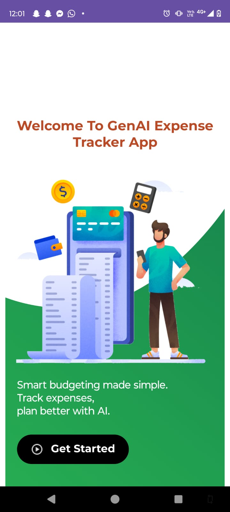

[View License](https://www.gnu.org/licenses/gpl-3.0)

# 📊 GenAI Expense Tracker App

A smart and modern mobile app built using **Android (Java/XML)** and **Firebase** to help users track their income and expenses, analyze spending patterns, and receive AI-generated financial insights in real time.

---

## 🚀 Features

- 📥 Add & categorize expenses and income
- 📊 Overview screen with custom BarChart (income vs expense vs savings)
- 🔐 Firebase Authentication (Email/Google/Facebook)
- ☁️ Data synced using Cloud Firestore
- 📁 Optional receipt/image upload to Firebase Storage
- 🧠 AI-driven insights & alerts (via Gemini AI + Firebase Extensions)
- 📆 Filter by week, month, or 6 months using ChipGroup
- 🎨 Modern UI/UX using custom design and icon sets
- 📲 Built for native Android devices

---

## 🛠 Tech Stack

- **Language:** Java
- **UI:** XML + Material 3 Components, Custom Views with Canvas
- **Architecture:** MVVM (ViewModel, LiveData)
- **Backend:** Firebase (Auth, Firestore, Storage)
- **Extras:** OpenAI API, Lottie Animations, Glide, 

---

## 📄 License

This project is licensed under the **GNU General Public License v3.0**.  
You may use, modify, and distribute this code under the terms of the GPL-3.0.  
**Any modified version must also be open-source and under the same license.**

See full license: [LICENSE](./LICENSE)

---

## 📸 Screenshots

### 🔐 Authentication

| Welcome Screen | Sign In | Signing In (Loading) | Sign In Failed |
|----------------|---------|-----------------------|----------------|
|  |  |  |  |

| Google Sign-In | Sign Up | Reset Password |
|----------------|-------------------|---------|
|  |  |  |

---

### 🏠 Home & Navigation

| Home (With Data) | Home (No Data Found) | Navigation Drawer |
|------------------|----------------------|-------------------|
|  |  |  |

---

### ➕ Income & Expense

| Add Expense (FAB) | Expense (Monthly) | Expense (Weekly) | Income (Weekly) |
|-------------------|-------------------|------------------|------------------|
|  |  |  |  |

---

### 📊 Overview & AI Insights

| Overview (May Chart) | Overview (June Summary) | AI Insights (Generate) | AI Insights (Generating PDF) |
|----------------------|--------------------------|-------------------------|------------------------------|
|  |  |  |  |

---

### 📥 Reports & Notifications

| Notifications | System Notification (Financial Alert) | Download PDF |
|---------------|----------------------------------------|----------------|
|  |  |  |

---

### 👤 Profile & Legal

| Profile (Edit Info) | Privacy Policy |
|---------------------|----------------|
|  |  |

---

>  📁 Screenshots are stored in the /screenshots folder within the project repository.
---

### 🧠 AI Generated PDF of GenAI Expense Tracker App

📄 [View Sample AI Insights PDF Report](screenshots/AI_Insights_Report.pdf)

This professionally styled PDF was generated using **Gemini AI (by Google)** and Firebase data integration. It provides users with intelligent, data-driven financial feedback.

**Key Features of the Report:**
- 📊 **Monthly Expense Summary** with income, expense, and savings breakdown
- 🍽️ **Categorized Spending Insights** (e.g., Food, Grocery, Transport)
- 💡 **AI-Based Financial Overview** with smart suggestions per category
- 📈 **Auto-Generated Donut Chart** showing expense distribution
- 📅 **Time-Based Filtering** (Weekly/Monthly)
- ✅ **Overall Summary** with savings feedback and budget recommendations
- 🧠 Powered by **Gemini AI** for personalized insight generation
- 📥 Easily downloadable for offline reference

---

## 📦 How to Run

1. Clone this repo:  
   `git clone https://github.com/KapilPandey94/genai-expense-tracker.git`

2. Open in **Android Studio**

3. Connect Firebase via Firebase Assistant

4. Add your `google-services.json` file

5. Run on emulator or physical Android device

---

## 🤝 Contributions

Contributions, suggestions, and improvements are welcome!  
If you'd like to contribute, please fork the repository and submit a pull request.  
For significant changes, kindly open an issue first to discuss your ideas.

---

## 📬 Contact

📧 [LinkedIn – Kapil Pandey](https://www.linkedin.com/in/kapil-pandey-568353318)  
🌐 [GitHub – KapilPandey94](https://github.com/KapilPandey94)

---

### 🔖 #android #firebase #mvvm #expense-tracker #openai #mobileapp #firebaseauth #cloudfirestore
